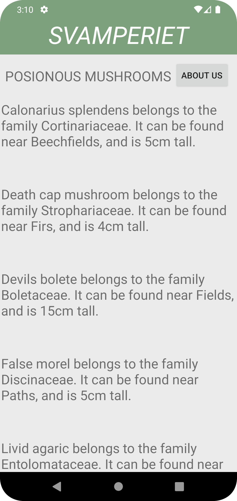
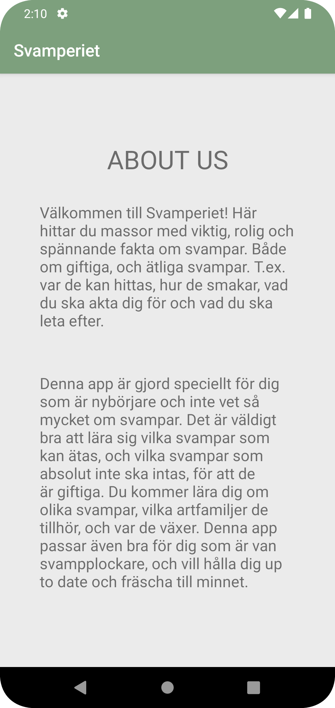

# Rapport

Tre stycken mainactivities har skapats. En för recyclerView och en för textView som ska visa Json-datan. En tredje för "About us"-sidan. RecyclerViewAdapter har skapats, för att ta emot
Json-datan och koppla den till RecyclerViewn. En knapp finns på startsidan, activity_main, som tar en till activity_main3/about us-sidan.
JsonTask och JsonFile har använts för att kunna ta emot URLen med json-datan, och en JsonFile som tar emot Json-datan som är en asset, ifall URL inte skulle fungera.
En klass har skapats som tar emot Json-data, genom den bestäms det vad som ska skrivas ut och i vilken ordning.
Tillslut har appen styleats, och strings för About us-sidan med text lagts till.


Programkod - svamp class. De olika attributen som ska synas och skrivas ut har initierats. Sedan har attributen i public String getTitle skrivits ut i rätt ordning tillsammans med förklarande text för attributen.

Programkod - onPostExecute. Längst ner i MainActivity.java, finns det en onPostExecute. Den tar emot Json-datan, och med hjälp av gson förvandlas Json-datan så den kan parsas.
```
Programkod - svamp class

    public String getTitle(){
        String str=name;
        str+=" belongs to the family ";
        str+=category;
        str+= ". It can be found near ";
        str+=location;
        str+=", and is ";
        str+=size;
        str+="cm tall.";
        return str;
    }
    
Programkod - onPostExecute

    @Override
    public void onPostExecute(String json) {
        Gson gson = new Gson();
        Type type = new TypeToken<List<Svamp>>() {}.getType();
        svamp = gson.fromJson(json, type);
    }
    
      
```

Bilder.




